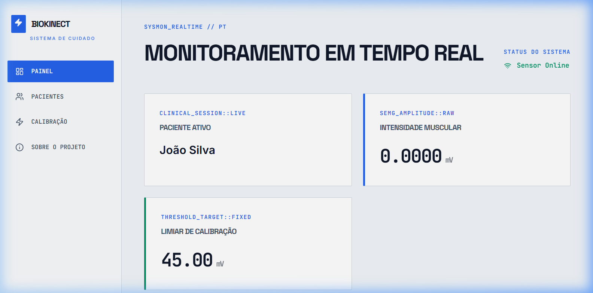
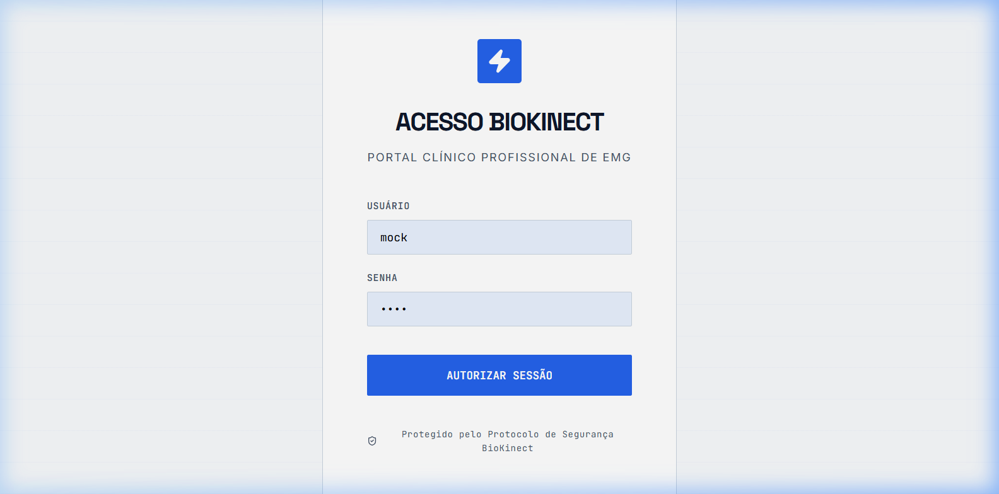
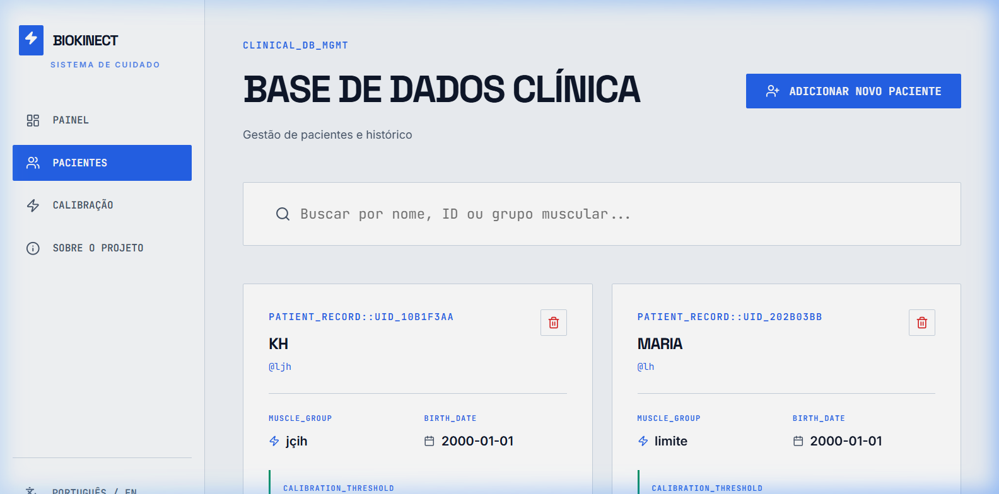
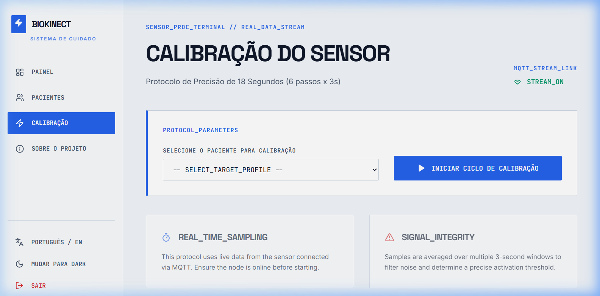
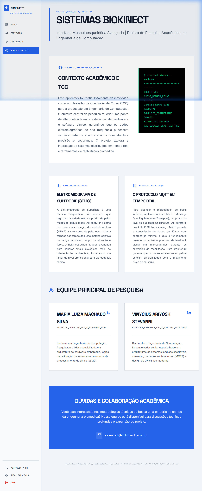

# BioKinectCare: Advanced Musculoskeletal Interface

BioKinectCare is a professional electromyography (sEMG) analysis platform developed as a Bachelor's Thesis (TCC) for Computer Engineering. It integrates high-frequency hardware sensing with real-time distributed protocols (MQTT) to provide clinicians with a precise tool for muscle rehabilitation monitoring.

---

## 📘 Platform Tutorial & User Manual

### 1. Authentication & Security

Access the platform via the secure clinical portal. The system uses a centralized database for clinician accounts, ensuring that only authorized therapists can access patient records.

**Initial Credentials:**

- **User:** `admin`
- **Password:** `admin123`

### 2. Clinical Database Management

The **Patients** module serves as the central repository for clinical history. Here you can:

- **Register New Patients**: Categorized by target muscle groups and clinical IDs.
- **Search & Filter**: Quickly locate records using the optimized search bar.
- **Persistent Storage**: All records are synchronized with a high-availability PostgreSQL database.

### 3. Precision Calibration Protocol (18s)

Before active monitoring, the system requires a calibration cycle to define the activation threshold for each specific patient.

- **Duration**: 18 seconds total.
- **Execution**: 6 alternating phases of 3 seconds each (Rest vs. Maximum Voluntary Contraction).
- **Goal**: To calculate the optimal millivolt (mV) threshold for biofeedback.

### 4. Real-Time sEMG Monitoring

The **Dashboard** provides a high-fidelity visual representation of muscle activity streamed via MQTT WebSockets.

- **Live Oscilloscope**: 10Hz+ refresh rate with low-latency signal rendering.
- **Metrics**: Real-time monitoring of Muscle Intensity (mV) and threshold crossings.
- **Telemetry**: Hardware status monitoring (Sensor Online/Offline).

### 5. Academic & Research Context

Derived from a Computer Engineering degree program, BioKinectCare is rooted in technical excellence. The **About Project** page details:

- **Principal Researchers**: Maria Luiza Machado Silva & Vinycius Ariyoshi Stevani.
- **Methodology**: Detailed explainers on sEMG signal processing and the MQTT distributed architecture.
- **Bilingual Interface**: Seamlessly switch between English and Portuguese for localized research usage.

---

## 🛠️ Technical Architecture

### Component Stack

- **Frontend**: React 18, Vite, TypeScript, Chart.js.
- **Backend**: Python FastAPI, SQLAlchemy (PostgreSQL), JWT Auth.
- **Messaging**: Eclipse Mosquitto (MQTT) over WebSockets (9001).
- **Infrastructure**: Fully containerized using Docker & Docker Compose.

### Quick Launch

1. Ensure Docker is installed.
2. Run `docker-compose up --build -d`.
3. Open [http://localhost:3000](http://localhost:3000).

---

*Developed with focus on signal precision and clinical usability.*
